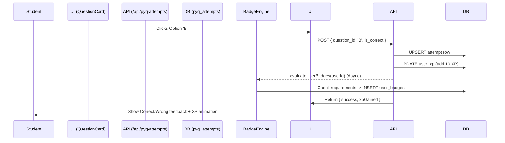
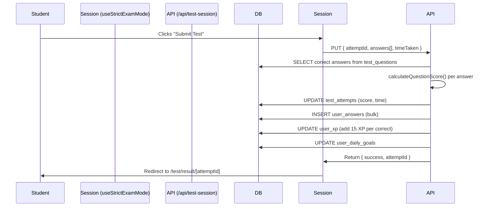

---

## 12. Admin CMS

The Admin CMS is a gated area (`/admin`) for platform operators.

### Security
- UI is protected by `layout.js` calling `isAdmin()`
- APIs are protected by `isAdmin()` inside each route handler
- `isAdmin()` checks `auth().sessionClaims?.metadata?.role === "admin"`
- All Admin APIs use `supabaseAdmin` service role client (bypasses RLS)

### Sections

| Page | Functionality |
|------|---------------|
| `/admin` | Dashboard stats (Exams, Questions, Missing images, Students) |
| `/admin/exams` | Create/Edit/Delete exam paper metadata. Can toggle `is_published`. |
| `/admin/import` | CSV Question Uploader. Parses CSV, handles MCQ/Numerical mapping, skips duplicates. |
| `/admin/questions` | Question search, filter, edit, delete. Decrements exam counter on delete. |
| `/admin/images` | Filter for questions missing images. Upload to Supabase Storage, assigns URL. |
| `/admin/students` | Search directory. Joins profiles, XP, badges, test history. |
| `/admin/notifications`| Broadcast alerts to ALL, JEE, or NEET tracks. Realtime delivery. |
| `/admin/badges` | Create and configure new badge types and requirements. |
| `/admin/goals` | Create and configure new daily goals. |

### The Question Import Pipeline
1. Admin creates Exam (e.g. "JEE Main 2024 Jan Shift 1")
2. Admin uploads CSV
3. `PapaParse` reads CSV headers -> maps to DB columns
4. Detects duplicates (same text + same exam + same year)
5. Inserts valid questions -> calls RPC `increment_exam_question_count`
6. Admin goes to `/admin/images` to upload diagrams for new questions
7. Admin goes back to `/admin/exams` and sets `is_published = true`
8. Exam is now live for students

---

## 13. API Documentation

PrepZii exclusively uses Next.js Route Handlers. **There is no separate Express/Django backend.**

### Conventions
- Responses are always JSON: `{ [data_key]: data }` or `{ error: "Message" }`
- Errors return HTTP status codes (400, 401, 403, 500)
- Authenticated routes extract `userId` via `const { userId } = auth()`
- Admin routes start with `const adminUser = await isAdmin(); if (!adminUser) return new NextResponse("Unauthorized", { status: 403 })`

### Core Endpoints

#### PYQ Operations
- `GET /api/pyq` - Get questions. Params: `exam`, `subject`, `chapter`, `mode`, etc.
- `GET /api/pyq/papers` - List published exams
- `GET /api/pyq/chapters` - List unique chapters
- `POST /api/pyq-attempts` - Record attempt. Body: `{ pyq_question_id, selected_option, is_correct, exam }`
- `GET /api/pyq/overview` - DB stats (years range, total counts)
- `GET /api/pyq/analytics` - PYQ accuracy + streaks

#### Test Operations
- `POST /api/test-session` - Create test. Body: `{ mode, track, exam, subjects, difficulty, duration, count }`
- `PUT /api/test-session` - Submit test. Body: `{ attemptId, answers, timeTaken, duration }`
- `GET /api/test-attempts` - List user history.
- `GET /api/test-attempts/[id]` - Get single attempt summary.
- `GET /api/test-attempts/[id]/review` - Get full attempt detailed answers.

#### Gamification & Social
- `POST /api/update` - Batch XP update. Body: `{ correctAnswers, totalQuestions, source }`
- `GET /api/profile` - User profile, level, track
- `POST /api/profile/update` - Update name/track/year
- `GET /api/pyq/leaderboard` - Global Top 10
- `GET /api/daily-goals` - User's active goals
- `GET /api/notifications` - User's notification inbox

#### External Integrations
- `POST /api/explain` - Calls Anthropic Claude
- `POST /api/payment/create-order` - Calls Razorpay API
- `POST /api/payment/verify` - HMAC signature validation
- `POST /api/webhooks/clerk` - Clerk auth sync webhook

---

## 14. Component Architecture

### The `src/components` Directory

PrepZii follows a component-driven architecture. 

**Global Layout Components:**
- `<PageWrapper>` - Ambient background gradients. Wraps almost every dashboard page.
- `<Navbar>` - Top navigation, Pro badge, Profile dropdown, Notification bell. Auto-hides on `/session` routes.
- `<AuthLayout>` - Centered split-screen layout used for Sign In / Sign Up.

**Data Display Components:**
- `<StatsCards>` - 3-card grid (Accuracy, Rank, Streak).
- `<DailyGoals>` - Interactive goal tracker card. Re-fetches on window focus.
- `<UserGreeting>` - Reads user name and local time to display "Good Morning, Name".

**Domain-Specific:**
- `/test` -> `<TestBuilder>`, `<QuickTest>`, `<QuestionPalette>`, `<TestQuestionPanel>`
- `/pyq` -> `<QuestionCard>`, `<ExplanationCard>`, `<PracticeTab>`, `<AnalyticsTab>`
- `/admin` -> `<ExamManager>`, `<QuestionManager>`, `<ImageManager>`, `<BadgeManager>`
- `/community` -> `<CommunityHub>`, `<GroupCard>`, `<GroupChat>`, `<DMChat>`, `<DMInbox>`

### The `<MathText>` Component
Because JEE/NEET questions contain heavy mathematics, all text rendering goes through `<MathText>`.
- Wraps `react-latex-next` (KaTeX)
- Parses `$$...$$` (block) and `$...$` or `\(...\)` (inline) LaTeX strings
- Handles fallback if LaTeX rendering fails
- **Rule:** Never use standard `div` or `p` tags to render raw question text. Always use `<MathText text={question.text} />`.

---

## 15. State Management

PrepZii avoids heavy global state managers like Redux or Zustand. State is managed using Next.js and React primitives.

### 1. Server State (Next.js Server Components)
Whenever possible, data is fetched on the server and passed as props to Client Components.
Example: `/dashboard` fetches profile data on the server, passes `activeTrackKey` down.

### 2. URL State (Search Params)
Search parameters are used extensively for shareable state.
Example: `/pyq/session?exam=JEE&subject=Physics&mode=full`

### 3. Session Storage (Transient State)
Used for data that shouldn't survive a tab close, but must survive page navigation.
Example: Test Builder configuration is saved to `sessionStorage` before navigating to `/test/session`.

### 4. Client State (React `useState` / `useReducer`)
Complex interactive components like the Test Session or PYQ Studio use local component state.
Example: `selectedAnswers` in the test engine is a local state object map.

### 5. Client Caching (`src/lib/pyq.js`)
The client-side `getPYQ` wrapper implements a lightweight memory cache (`fetchCache`) with a 30-second TTL to prevent redundant network requests when switching tabs in the PYQ studio.

---

## 16. Design System

PrepZii uses a custom design system built on top of **Tailwind CSS v4**.

### `src/app/globals.css`
This file is the single source of truth for the design system. It contains:
1. **CSS Variables (Tokens):** Mapped to HSL values for seamless Light/Dark mode switching.
2. **Typography:** Uses the `Outfit` font family.
3. **Utility Classes:** Custom classes like `.glass-panel`, `.text-gradient`, `.card-hover`.
4. **Keyframe Animations:** `.animate-blob`, `.animate-float`, `.animate-pulse-slow`.

### Core Color Palette
- **Primary:** Purple/Indigo gradient (`from-purple-600 to-indigo-600`)
- **Secondary:** Teal/Cyan accents (`from-teal-400 to-cyan-500`)
- **Success:** Emerald green (`text-emerald-500`)
- **Danger:** Rose red (`text-rose-500`)
- **Warning:** Amber yellow (`text-amber-500`)
- **Surface:** Glassmorphic white/black with opacity (`bg-white/10 dark:bg-black/40`)

### Glassmorphism
The platform heavily uses the glassmorphism aesthetic:
- Transparent backgrounds (`bg-white/5`)
- Backdrop blur (`backdrop-blur-xl`)
- Subtle borders (`border-white/10`)
- Inner shadows and glows

### Animations
Micro-interactions are prioritized:
- `transition-all duration-300` is standard on all interactive elements
- Cards lift on hover (`hover:-translate-y-1 hover:shadow-xl`)
- Buttons use `active:scale-95` for tactile feedback

---

## 17. Performance Audit

PrepZii is optimized for perceived performance rather than absolute minimalism.

### Caching Strategy
- Server Actions invalidate specific paths using `revalidatePath()`
- Client-side data fetching uses `useMemo` and the `fetchCache` dictionary
- High-cost aggregate queries (like `getUserAnalytics`) could benefit from Redis caching in the future, but currently run live on the PostgreSQL database

### Database Optimization
- `pyq_exams.question_count` is denormalized and maintained via RPC to avoid `COUNT(*)` queries on the massive `pyq_questions` table.
- Leaderboard uses a denormalized `name` column in `user_xp` to avoid joining `user_profiles` for every row.

### Image Optimization
- The `useQuestionImagePreload` hook silently fetches the images for the *next* 2 questions in the background while the user is looking at the current question. This ensures zero latency when clicking "Next".

---

## 18. Security Audit

### Row Level Security (RLS)
The Supabase database has RLS enabled.
- Anonymous client (`supabase.js`) is bound by RLS policies.
- Example Policy: User can only `SELECT` from `user_profiles` where `clerk_user_id = auth.uid()`.

### Service Role Client
`supabaseAdmin.js` uses the Service Role Key, which bypasses RLS.
- **Rule:** Never use `supabaseAdmin` in client components or untrusted server contexts.
- It is only used in secure Next.js API Routes after validating the user via Clerk `auth()`.

### Anti-Cheat Mechanisms
- `useStrictExamMode` hook blocks navigation, copy-paste, and tab switching during tests.
- `/api/pyq` redacts the `correct_option` and `explanation` fields for unattempted questions at the database query level. The client never receives the correct answer until the attempt is submitted.

### Authentication
- Clerk handles all password hashing, session management, and OAuth.
- PrepZii backend never sees user passwords.

---

## 19. Current Technical Debt

As a Lead Architect, you should be aware of these existing issues:

1. **Anthropic API Key Exposure (CRITICAL):**
   - The `QuestionCard.jsx` component currently makes direct calls to the Anthropic API from the client side.
   - **Fix Required:** Route all AI explanation requests through the `/api/explain` endpoint.

2. **Community RLS Policies (HIGH):**
   - The Community schema is deployed, but only `community_groups` has a `SELECT` RLS policy. Other tables lack RLS, relying entirely on server-side validation in API routes.
   - **Fix Required:** Define full RLS policies for all 11 community tables.

3. **Chart.js CDN Dependency (MEDIUM):**
   - The Analytics dashboard loads Chart.js via a script tag from a CDN. This causes a layout shift and a delay in rendering charts.
   - **Fix Required:** Migrate to a bundled charting library (e.g., `recharts` or `react-chartjs-2`).

4. **`created_at` vs `attempted_at` (MEDIUM):**
   - The `pyq_attempts` table uses `attempted_at` as its timestamp column, while most other tables use `created_at`. This inconsistency causes confusion when writing aggregate queries.

5. **Question ID Types (LOW):**
   - `pyq_bookmarks.question_id` is stored as a `text` string, but it references a `uuid` column in `pyq_questions`. This requires manual type casting in queries.

---

## 20. Future Architecture

The system is designed to scale horizontally. Future architectural evolutions planned:

1. **Redis Implementation:**
   - Caching `getUserAnalytics()` results.
   - Caching the Global Leaderboard (currently a full table scan on `user_xp`).
   - Managing Community Chat presence (online/offline status).

2. **WebSockets (Socket.io) vs Supabase Realtime:**
   - Currently, Community chat uses Supabase Realtime (PostgreSQL triggers).
   - As message volume grows, moving chat to a dedicated Redis/Socket.io microservice will reduce database load.

3. **Edge Functions:**
   - Moving the Test Scoring logic and PYQ API routes to Vercel Edge Functions to reduce latency.

---

## 21. Data Flow Diagrams

### PYQ Answer Submission Flow



### Mock Test Submission Flow



---

## 22. Final System Map

```
[ User (Student) ]
       │
       ▼
[ Clerk Auth ] ──(Webhook)──> [ Supabase (user_profiles) ]
       │
       ▼
[ Next.js Client (App Router) ]
       │
       ├── [ /dashboard ] ────> [ Daily Goals / Stats ]
       │
       ├── [ /pyq ] ──────────> [ PYQ Engine ] <──────┐
       │                                              │
       ├── [ /test ] ─────────> [ Test Engine ] <─────┤
       │                                              │
       ├── [ /analytics ] ────> [ Aggregation ] <─────┤
       │                                              │
       └── [ /community ] ────> [ Realtime Chat ]     │
       │                                              │
       ▼                                              ▼
[ Next.js API Routes (Server) ]               [ External APIs ]
       │                                              │
       ├── /api/pyq             <──────────>  Anthropic (Claude)
       ├── /api/test-session
       ├── /api/community
       └── /api/payment         <──────────>  Razorpay
       │
       ▼
[ Supabase PostgreSQL ]
       ├── user_profiles, user_xp, badges
       ├── pyq_questions, pyq_exams, pyq_attempts
       ├── questions, tests, test_attempts, user_answers
       └── community_groups, community_messages
```

---

**End of PrepZii Engineering Handbook v1.0.** 
*Welcome to the team.*
