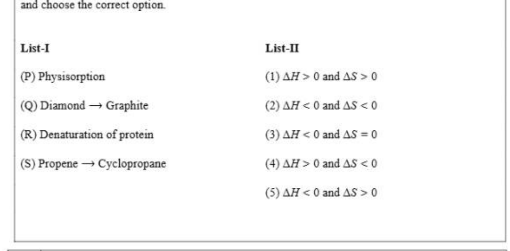
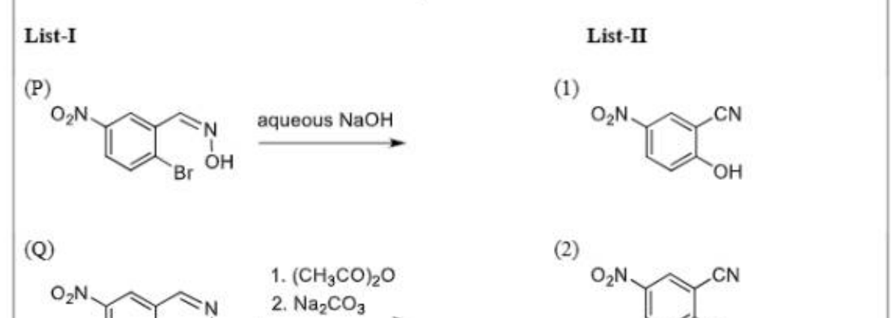

# Paper1 Chemistry

## Section Headers

- JEE (Advanced) 2026 Paper 1
- SECTION 1 (Maximum Marks: 12)
- * This section contains FOUR (04) questions.
- * EEach question has FOUR options (A), (B), (C) and (D). ONLY ONE of these four options is the correct
- answer.
- * For eEach question, ch\inftyse the option corresponding to the correct answer.
- * Answer to eEach question will be evaluated according to the following marking scheme:
- Full Marks : +3. If ONLY the correct option is chosen;
- Zero Marks : 0 Ifnone of the options is chosen (i.e. the question is unanswered);
- Negative Marks : -1 In all other cases.

## Q.1

Q.1 An ideal gas (0.5 mol), initially at 2 bar pressure. is compressed at a constant temperature of 6\infty K
in two steps: first, against a constant external pressure of P bar (2 < P < 8), and then against constant
external pressure of 8 bar. At each step, the compression is stopped only when the pressure of the gas
becomes equal to the external pressure. The total work done on the gas in these steps is W.
Considering all possible values of P (2 < P< 8) and taking the gas constant as R (in JK“ mol”), the
minimum value of |) (in J) is

- (A) | 207R
- (B) | 6\inftyR (c) | 630R
- (D) | 9\inftyR Q2 | Forareversible reaction R = P, at constant temperature, both the forward and the backward reactions are first order elementary reactions with rate constants k: and /y, respectively. At time zero, the concentration of R is [R]o and the concentration of P is zero. At any given time, [R] and [P] are the concentrations of R and P. respectively. If 4 = 44^2, the correct graphical representation of the reaction is (a) [P}ER]o we ON 5 imn-> Ole 'T (0) oe i g 0.6 5 04 zg \infty (PYIR), 0 time -> 10

## Q.6

Q.6 | Correct statement(s) about the compounds X, Y and Z is(are)
\[MnO, + Cone, HC] ---> MnCl, + xX + H,0\]
(greenish yellow gas)
\[NH; + X --> Y + HCl\]
(excess)
\[573K\]
\[X + F, --~., Z\]
(excess)

- (A) | Xis used for sterilizing drinking water.
- (B) | Y has a planar structure.
- (C) | Zisused in the enrichment of **U.
- (D) | Visa stronger Lewis base than ammonia. Q7 | Reaction of PtFs with oxygen (O2) gas results in the formation of an ionic compound, X-Y-. Correct statement(s) is(are)

## Q.10

Q.10 “The total number of all possible isomers for the square planar complex with formula |
\[K[M(NCS)(NO2X(gly)] is____-\]
(M = metal ion and gly = NH,;>CH;COO7)

- Numerical answer: __________

## Q.11

Q.11 | The sum of total number of carbonyl groups ( >C=O ) present in the major products X and Y in the
following reactions is .
ie]
HC CH; heat
pS x
HO,C COH
COs heat
fe) Es Y
CO3H

- Numerical answer: __________

## Q.12

Q.12 | Treatment of buta-1,3-diyne with NaNHz (2 equivalents), followed by reaction with excess of
trans-CH3-CH=CH-CH2-Br gives X as the major product. The maximum number of carbon atoms
that are collinear (in a straight line) in X is :
\[610\]

- Numerical answer: __________

## Q.13

Q.13 | List-I contains various physical/chemical processes, and List-II contains combinations of changes
in enthalpy (AH) and entropy (AS). Match each entry in List-I to the appropriate entry in List-II,
and ch\inftyse the correct option.
List-I List-II
\[(P) Physisorption (1) AH > 0 and AS > 0\]
\[(Q) Diamond - Graphite (2) AH < 0 and AS < 0\]
(R) Denaturation of protein (3) AH < O and AS =0
\[(S) Propene - Cyclopropane (4) AH > 0 and AS < 0\]
\[(5) AH < 0 and AS > 0\]

[Figure/Diagram - see cropped image]

- (A) | P32;Q33;R35;S34
- (B) | P+4;Q33;R75;S31
- (C) | P32;Q35;R31;834
- (D) | P+2;Q>5;R>1;833 710

## Q.14

Q.14_ | Consider the following species:
SOCIz, XeOFs, CIFs, CIFs, XeFs, SO:*, XeFs", SFs
List-I contains different molecular shapes and List-II contains total number of species with the
same molecular shapes from the given species. Match each entry in List-I with the appropriate
entry in List-II and ch\inftyse the correct option.
List-I List-II
\[(P) See-saw (1) one\]
\[(Q) T-Shaped (2) two\]
\[(R) Trigonal Planar (3) three\]
\[(S) Square Pyramidal (4) four\]
\[(5) zero\]

- (A) | P31:Q32:R35:833
- (B) | P+5;Q>4;R32:S833
- (C) | P+3;Q32;R31;834
- (D) | P31:Q33;R>5;S34 8/10

## Q.15

Q.15 | The List-II contains products obtained from the reaction of compounds in List-I with O3/Zn-H20
followed by cyclization (via more stable enolate) in the presence of aqueous NaOH. Match each
entry in List-I with appropriate entry in List-II and ch\inftyse the correct option.
List-I List-II
\[) (1)\]
Hy HyC (e)
CH ia CH;
Q) Q)
CH; ue fe}
CHs Hat
\[) Q3)\]
CH; ws °
3
CH; H;C OH
\[(S) (4)\]
CH; H3C HO fe]
CH
6)
6 CHs

- (A) | P32:Q34:R1:833
- (B) | P-33:Q74:R-5:8-2
- (C) |P32;Q731,R75,;83 @) | P-3:Q-5:R-4;8-2 9/10

## Q.16

Q.16 | Match the major products obtained in the reactions given in List-I with the corresponding
structures in List-II and ch\inftyse the correct option.
List-I List-II
\[(P) (1)\]
OG: aqueous NaOH O2N oe
1 cl
Br OH OH
\[(Q) 2)\]
\[1. (CH3CO),0 O2N CN\]
\[O2N 1oe: 2. NagCO3 CL\]
\[t ee E_-_-\]
B
Br OH if
\[(R) GB)\]
CH;
O.N N cH
“or aqueous NaOH . od Yr
ices fe)
Br OH Br
\[(S) (4)\]
CH;
OoN re) CH, @queous N
2 N° NazCOs 0
fa) tt
Br
\[(5)\]
CH;
-
Gul
Br

[Figure/Diagram - see cropped image]

- (A) |P--2;Q31;R-5;S-4
- (B) | P-1;Q32;R- 4:85
- (C) | P-1:Q32:R--3:S-4 @) | P-2;Q1;R-3;8-5 END OF THE QUESTION PAPER 1010
