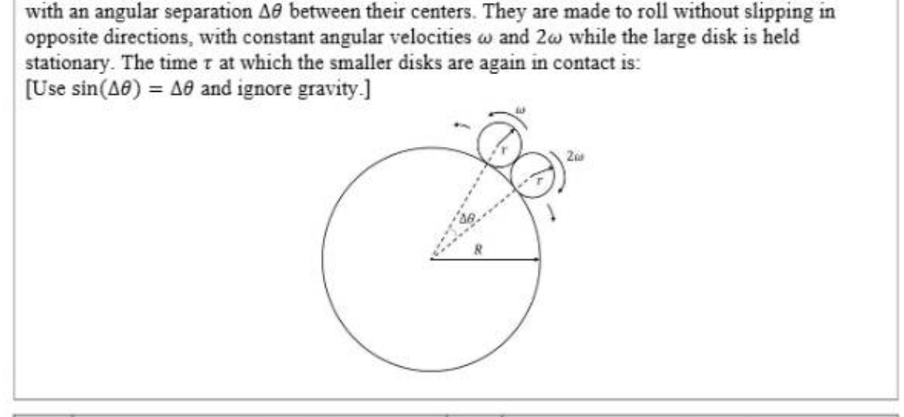
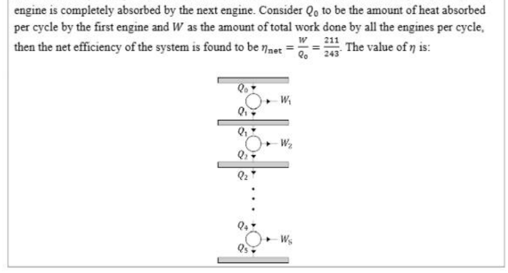
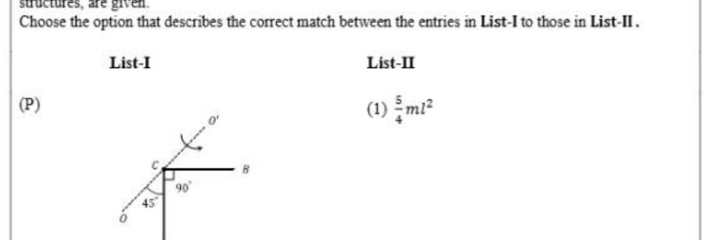

# Paper1 Physics

## Section Headers

- JEE (Advanced) 2026 Paper 1
- SECTION 1 (Maximum Marks:12)
- * This section contains Four (04) questions.
- e Each question has FOUR options (A), (8), (C) and (D). ONLY ONE of these four options is the correct
- answer.
- ** For eEach question, ch\inftyse the option corresponding to the correct answer.
- « Answer to eEach question will be evaluated according to the following marking scheme:
- Full Marks : +3 If ONLY the correct option is chosen;
- Zero Marks : 0 Ifnone of the options is chosen (i.e. the question is unanswered);
- Negative Marks : -1 In all other cases.

## Q.1

Q.1 | Consider a large disk of radius R and two smaller disks, each of radius r = R/50, lying on its
circumference, as shown in the figure. The smaller disks are initially in contact with each other,
with an angular separation \Delta\theta between their centers. They are made to roll without slipping in
opposite directions, with constant angular velocities w and 2w while the large disk is held
stationary. The time r at which the smaller disks are again in contact is:
[Use sin(\Delta\theta) = \Delta\theta and ignore gravity_]
ae (ae
\[x x (2 si) /@\]
2
\[= 51 x (2n- =) /3w\]

[Figure/Diagram - see cropped image]

- (A)
- (B) (©)
- (D) r= Six (2-2) 3 r=51x(2e-=) /o $1 4

## Q.2

Q.2 | Consider a circuit consisting of a capacitor of capacitance C and a coil with N tums per unit length,
cross sectional area S and length d, where d^2 >> S. There is another coil of length d/2. cross
sectional area S/2 and 2N turns per unit length completely inside the larger coil, as shown in the
figure. The ends of this smaller coil are connected with each other by an insulated conducting wire.
The self-inductance of the larger coil is L. Neglecting edge effects and all the Ohmic resistances.
the resonant frequency of the circuit 1s:
\[(a) 4 B) 6 © 2 ©) ;\]
\[ViS LC vSLC V3LC 31\]
3 |
Q A solid cylinder of radius rolls without slipping witha center of mass speed vp = #* ona
horizontal surface with a vertical edge, as shown in the figure. Here. g is the acceleration due to the
gravity. At the moment when the cylinder loses contact with the surface due to rotation around the
corner, the speed of its center of mass is:

- (A) 0 8) ‘sok
- (C) () 3gR 214

## Q.7

Q.7 | A quasi-static cycle of a monoatomic ideal gas contains an isothermal process (ab), followed by an
| isochoric process (be) and an adiabatic process (ca) as shown in the figure. The volumes of the gas
are V, and V2 at a and b, respectively. If the cycle has heat input Q;,, and output Qu. then the
efficiency of the cycle is defined as n = ar The correct statement(s) is/are:
in
\[[Given: In2 ¥ 0.7]\]
‘
.
A v, OV

- (A) | IfV,/V, = 8, the heat released in the process be is smaller than the heat absorbed in the process ab.
- (B) | Fora given value of V2/V;. does not depend on the temperature of the isothermal process.
- (C) | IfV,/V, = 8, then the temperature of the gas at a is 4 times the temperature of the gas at c.
- (D) | IfV2/V, = 8, then the pressure of the gas at a is 4 times the pressure of the gas at b. 14

## Q.10

Q.10 | As shown in the figure, five Carnot engines, each with efficiency 7 and same number of cycles per
unit time, are operating between six heat reservoirs. The amount of heat released per cycle by one
engine is completely absorbed by the next engine. Consider Qp to be the amount of heat absorbed
per cycle by the first engine and W as the amount of total work done by all the engines per cycle,
\[Ww 211\]
then the net efficiency of the system is found to be nex = 9- = 345- The value of 7 is:
iJ

[Figure/Diagram - see cropped image]

- Numerical answer: __________

## Q.11

Q.11 As shown in the figure, an insulated container is fitted with a thermally conducting but immovable |
partition (P,) and a freely movable but thermally insulated piston (P,). The partition P, with
thermal conductivity K, cross sectional area A and width x divides the container into two sections,
5, and 52, each containing one mole of a monoatomic gas. The piston P, moves freely such that the
gas in S, is always at the atmospheric pressure. Initially, the difference between the temperatures of
5; and Sz is AT. The time it takes for the temperature difference to become is nxR/KA, where
R is the universal gas constant. The value of n is:
\[[ Given: In2 © 0.7]\]
ate
S; Sz
14

- Numerical answer: __________

## Q.12

Q.12 | A hollow, right circular cone of base radius R and height h, with its tip at the origin is rotating
about the Z-axis with an angular velocity w, as shown in the figure. The cone carries a total
charge Q uniformly distributed on its curved surface. The magnitude of magnetic field at a
point (0,0,z), where z > R and z > h, is ce Es, The value of n is:
Zz
pw
os

- Numerical answer: __________

## Q.13

Q.13 | List-I shows four configurations made of straight and semi-circular narrow tubes containing air. A sound
wave of wavelength A = 0.29 m enters these structures at the pomt S and a sound detector is placed at D.
Between the points 5 and D, the sound travels only through the tubes. List-II contains the possible smallest
values of | (refer to the figures) for which the detector D records maximum amplitude. Ignore effects of
\[sharp comers. [Given cos(15°) = 0.97]\]
Ch\inftyse the option that best describes the match between the entries in List-I to those in List-II.
List-I List-II
\[) (1) 1.32m\]
\[Q (2) 1.19m\]
\[) (3)0.51m\]
\[(S) (4) 0.29 m\]
L
\[(5)0.13m\]

- (A) | P+4, Q-+3, R-+5, S-1
- (B) | P+4, Q-3, R-1, S-5
- (C) | P-3, Q-4, R-1, S-2
- (D) | P3, Q-+4, R-5, S-2 v4

## Q.14

Q.14 | Inthe List-L four optical effects are mentioned. The physical phenomena of light which are
essential to describe these optical effects are given in List-II. Ch\inftyse the option which describes
the correct match between the entries in List-I to those in List-II.
List-I List-I
(P) Colorful sky in north polar region (Aurora (1) Dispersion and reflection
Borealis)
(Q) Partially polarized sun light (2) Total internal reflection
\[(R) Rainbow (3) Diffraction\]
(S) Dark and bright fringes (4) Scattering of light by molecules in the
atmosphere
(5) Emission of radiation from oxygen
and nitrogen atoms excited by charged
particles

- (A) | P-5, Q--4, R--1, S-+3
- (B) | P-4, Q-2, R-1, S-3
- (C) | P-4, Q-1, R-2, S33
- (D) | P-5, Q+4,R-1, S-2 174

## Q.15

Q.15 | List-I contains four conducting l\inftyps lying in the XY plane. as shown in the figures. The l\inftyps
are rotating about Z axis passing through the point O with time period T in clockwise direction.
The region x > 0 contains a uniform magnetic field B in the +z direction. List-II contains the
qualitative variation of the induced current i(t) for each of these l\inftyps. Ch\inftyse the option which
describes the correct match between the entries in List-I to those in List-II.
List-I List-II
®) y ss
: T/2
/, | +»
i
\[Q : (2) it\]
\[fy G] oe 1 r/4 T\]
®) @) i
| rn
(S) y ® is
\[* o}-_-+____+»i\]
i T/2 T
SS ;
\[(3)\]

- (A) | P35,Q394,R31,833
- (B) P+3,Q72,R75,834 (©) |P+3,Q72R71,844 ©) P+5,Q31,R>2,833 13/14

## Q.16

Q.16 | List-I shows four planar structures made of uniform solid rods each of mass m and length /. In the List-II
the possible moment of inertia of these structures about an axis CO", which lies in the plane of the
structures, are given.
Ch\inftyse the option that describes the correct match between the entries in List-I to those in List-II.
List-I List-II
\[(P) P (1) Smr\]
va
* 8
90°
fs
o
A
\[(Q® . (2) =mi^2\]
1
\[(R) @) qme\]
\[(s) (4) =mi^2\]
*
Cc
tg
A al a
\[(5) ; mi^2\]

[Figure/Diagram - see cropped image]

- (A) | P>5,Q>1,R> 4,832
- (B) | P+ 1,Q>3,R39 4,832 (©) | P45,Q43,R32,831
- (D) | P+5.Q94,.R72,S91 END OF THE QUESTION PAPER M4
