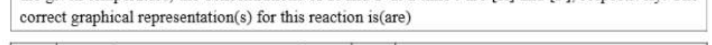
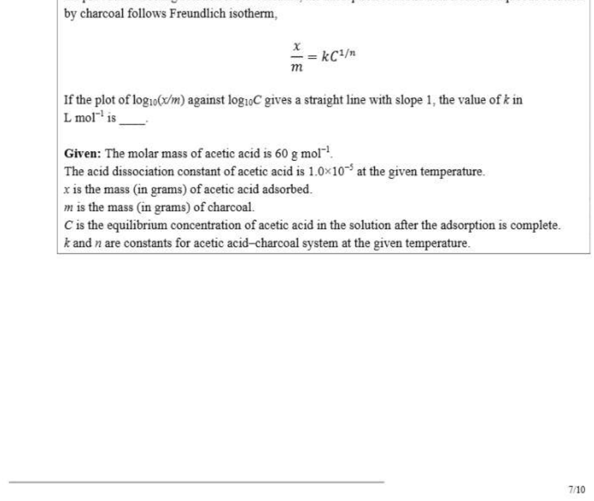

# Paper2 Chemistry

## Section Headers

- JEE (Advanced) 2026 Paper 2
- SECTION 1 (Maximum Marks: 12)
- * This section contains FOUR (04) questions.
- e EEach question has FOUR options (A), (B), (C) and (D). ONLY ONE of these four options is the correct
- answer.
- e For eEach question, ch\inftyse the option corresponding to the correct answer.
- « Answer to eEach question will be evaluated according to the following marking scheme:
- Full Marks : +3. If ONLY the correct option is chosen;
- Zero Marks : 0. Ifnone of the options is chosen (i.e. the question is unanswered);
- Negative Marks : -1 Inall other cases.

## Q.1

Q.1 | At 3\infty K, the molar conductivities of the aqueous solutions of three salts at two different
concentrations are given below:
Concentration | Molar conductivity
\[co (™) (S cm^2 mol!)\]
\[0.01 im\]
\[NENGs 0.04 101\]
\[, 0.01 17\]
\[Nat on 107\]
\[0.01 135\]
ANNO; = o4 I 116
The conductivity of a saturated aqueous solution of AgCl is 1.40x10~ § cm™ at 3\infty K. If the |
solubility of AgC! in water at 3\infty K is X mol L™', then logy(X~') is
(Assume that AgCl dissolved in water ionizes completely and that the molar conductivity of saturated
AgCl solution is equal to its limiting molar conductivity.)

- (A) | 3 (@) |4
- (C) | 5
- (D) | 6

## Q.2

Q.2 | The correct order of ONO bond angle in the given species is

- (A) | NOr <NO^2< NO; < NOY
- (B) | NOr <NOs < NO) < NOy
- (C) | NOs <NOr < NO^2 < NOY
- (D) | NOy < NO; < NO; < NO; 110

## Q.4

Q.4 | A known artificial sweetener X is composed of 4-chloro-4-deoxy-a-D-galactose and 1,6-dichloro-
1,6-dideoxy-B-D-fructose joined by a glycosidic linkage. Structure of D-galactose is given below: _
CHO
\[H-+-OH\]
\[HO---H\]
\[HO--+H D-galactose\]
\[H-+-OH\]
CH,OH
The correct structure of X is

- (A)
- (B) H OH m HCl cl rO * ~ H HO H H HO Ht OL CH,CI OH H (c) 3/10

## Q.5

Q.5 | Fora first-order reaction R - P at a given temperature, k is the rate constant. For this reaction, at
the given temperature, the concentrations of R and P at a time r are [R] and [P]., respectively. The
correct graphical representation(s) for this reaction is(are)

[Figure/Diagram - see cropped image]

- (A)
- (B) t t [P| a(R] dt - [R]|--~> © () al^2) : dt i- gd

## Q.6

Q.6 ‘Correct statement(s) about the compounds P, Q and R is(are)
\[873 K,7b\]
+ my Few ,
\[(1 : 5 ratio)\]
\[143K\]
P + = ODF, eet Q + OO;
complete hydrolysis
\[Q + 4H,O ---->- RR + HF\]

- (A) | P has two lone pairs of electrons on the central atom.
- (B) | Qhas a perfect octahedral geometry.
- (C) | Qcan act as a fluorinating agent.
- (D) | The molecular structure of R is trigonal pyramidal. 3/10

## Q.7

Q.7 | The correct statement(s) regarding the periodic properties of elements is(are)

- (A) | Second ionization enthalpy of carbon atom is less than that of boron atom.
- (B) | Increasing order of ionic radii: Al^2 <Mg^2*< Na
- (C) | Under identical conditions, in solid state, the density of potassium metal is more than density of sodium metal.
- (D) | The H-H bond ts weaker than F-F bond.

## Q.8

Q.8 In the following reaction sequence, P,Q. S and T are the major products.
\[1. H30^2\]
NH, 1. (CHsCO),0, pyridine 2. NeNO¥fICl
\[2. Conc. HNO3, Conc. H2SO,, 288 K 273 - 278K\]
_ P _
\[1. On/H30^2\]
HC. -CHs 9 NaOHICO, Q
\[3. H30°\]
Ss T
aqueous
NaOH
The correct statement(s) about P, Q, S and T is(are)

- (A) | Q on treatment with ethanol generates an aromatic aldehyde.
- (B) | S gives positive phthalein dye test.
- (C) | P is a dinitro compound.
- (D) | Tis acoloured compound.

## Q.9

Q.9 | The correct statement(s) regarding sugars is(are)
Given: Specific rotations of L-(-)-glucose and L-(+)-fructose are -52.5° and +92.5°, respectively.

- (A) | On treatment with HNOs, gluconic acid 1s oxidized to saccharic acid, whereas glucose is not oxidized to saccharic acid.
- (B) | Fructose gives a positive Fehling’s test because it isomerises to glucose and another aldohexose in the presence of Fehling’s reagent.
- (C) | Invert sugar is an equimolar mixture of D-glucose and D-fructose formed after hydrolysis of the corresponding disaccharide.
- (D) | Specific rotation of invert sugar is -40°. 6/10

## Q.10

Q.10 | x^2* and y’* are hydrogen-like species. The wavelength of light absorbed during the transition
between the states with principal quantum numbers n = 1 and n = 2 of X^2* is A. The wavelength of
light absorbed during the transition between the states with principal quantum numbers n = 2 and
n=4 of Y^2* is 9A. The lowest possible value of (a+b) is.

- Numerical answer: __________

## Q.11

Q.11 | Ata given temperature, 0.45 g of acetic acid in 50 mL of water is shaken with 1.0 g of charcoal and
the pH of the resulting solution is 3.0. Assume, the adsorption of acetic acid from the aqueous solution
by charcoal follows Freundlich isotherm,
= =kcin
m
If the plot of logio(x/m) against logioC gives a straight line with slope 1, the value of kin
L mol” is
Given: The molar mass of acetic acid is 60 g mol.
The acid dissociation constant of acetic acid is 1.010 at the given temperature.
x is the mass (in grams) of acetic acid adsorbed.
m is the mass (in grams) of charcoal.
Cis the equilibrium concentration of acetic acid in the solution after the adsorption is complete.
k and n are constants for acetic acid-charcoal system at the given temperature.
\[7/10\]

[Figure/Diagram - see cropped image]

- Numerical answer: __________

## Q.12

Q.12 | Ina solvent $, a compound B is partially dissociated into C and D as given below:
B = 2C+2D
B. C and D are non-volatile in nature. The molar mass of B is 10 times the molar mass of S. The
standard boiling pomt and the standard enthalpy of vaporization of S are 4\infty K and
10R J mol, respectively (R is the gas constant in JK” mol”). A solution of B in S with an initial
concentration of B as 0.25% (mass/mass) has a boiling point of 408 K at 1 bar pressure. In this
solution, the mole percent of B that has been dissociated is__-

- Numerical answer: __________

## Q.13

Q.13 | Consider that the c\inftyrdinating atoms of the ligands in cis-[Co(NH3)sCl]Cl and mer-[Co(NH3)3Cl3]
octahedral complexes are at the vertices of an octahedron. The sum of total number of the triangular
faces in both the complexes having one N atom and two Cl atoms at their comers is .

- Numerical answer: __________

## Q.14

Q.14 | In the following reaction sequence, major products X and Y are acyclic monomers.
1. KCN
\[2.H30°, A\]
3. Red P, Bro
\[4. NH (excess)\]
CH) ------> %*
\[H,0^2\]
Caprolactam ~_ Y
5\infty mol of X completely reacts with 5\infty mol of Y to give 1 mol of a single biodegradable acyclic
copolymer Z as the only product. The amount of Z formed in grams is 4
Given:
Atomic mass (in amu): H = 1,C :12,N: 14,0: 16, Br: 80
\[8/10\]

- Numerical answer: __________

## Shared Stem

Question Stem for Question Nos. 15 and 16
Two volatile liquids A and B form an ideal solution. Consider a 5 molal solution of B in A inside a closed
container having a total vapour pressure of 1\infty mm Hg at 3\infty K. The vapour pressure of pure A at 3\inftyK
is 105 mm Hg. Assume that A and B behave as ideal gases in the vapour phase.
Given:
The gas constant R = 0.08 L atm K™ mor!
Molar mass of A is 50 g mol!
Molar mass of B is 57 g mol
Density of liquid B at 3\infty K is 0.5 g/mL
\[1 atm = 760 mm Hg\]

## Q.15

Q.15 | At 3\infty K, the ratio of the molar volume of pure B in vapour phase to its molar volume in liquid
phase is .

- Numerical answer: __________

## Q.16

Q.16 | The mole fraction of B in vapour phase which is in equilibrium with this solution is :
\[9/10\]

- Numerical answer: __________

## Shared Stem

Question Stem for Question Nos. 17 and 18
Consider the following reaction sequence in which J, K, L and M are the major products.
NH3
(excess)
fe) L
1.1 Pl, anhyd. AICI, (nitrogen containing
\[Hs Nal, heat 1. abt -_-\]
ed 2. PBr3 ~K
NO, :
CH; (molar mass: 350 g/mol)
3.
NaO
PhSNa
M
(sulphur containing
compound)
Given:
Atomic mass (in amu): H : 1, C : 12,N-: 14,0: 16, S : 32, Br: 80, Ba: 137

## Q.17

Q.17 | The volume of 1 M aqueous H2SO; required to completely neutralize the ammonia evolved
from 5.72 g of L in Kjeldahl’s method of nitrogen estimation is mL.

- Numerical answer: __________

## Q.18

Q.18 | In sulphur estimation by Carius method, the amount of BaSO, formed from 3.79 g of M is
=
END OF THE QUESTION PAPER
\[10/10\]

- Numerical answer: __________
