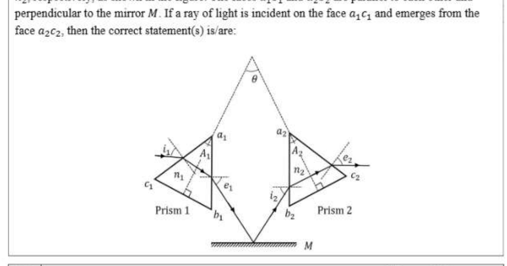
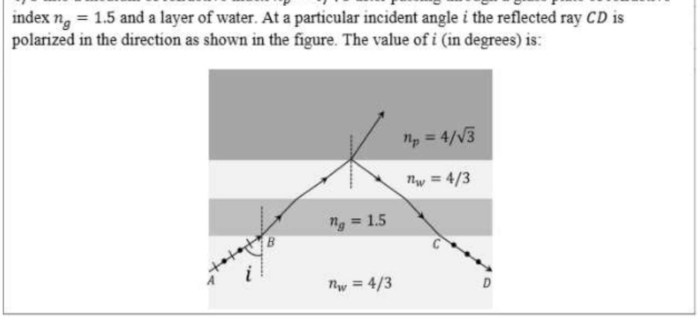

# Paper2 Physics

## Section Headers

- JEE (Advanced) 2026 Paper 2
- SECTION 1 (Maximum Marks: 12)
- * This section contains FOUR (04) questions.
- e EEach question has FOUR options (A), (B), (C) and (D). ONLY ONE of these four options is the correct
- answer.
- e For eEach question, ch\inftyse the option corresponding to the correct answer.
- * Answer to eEach question will be evaluated according to the following marking scheme:
- Full Marks : +3 If ONLY the correct option is chosen;
- Zero Marks : 0 Ifnone of the options is chosen (i.e. the question is unanswered);
- Negative Marks : -1 Inall other cases.

## Q.1

Q.1 | A metal wire of cross-sectional area 0.5 mm^2 and length 1\infty m is connected across a battery of
e.m_-f. 2 V and internal resistance 1 0. The density, atomic mass and electrical conductivity of the
\[metal are 6.35 x 10^2 kg\,m^{-3}_ 63.5 gm/mole and 2 x 10° \Omega^{-1} m~}, respectively. Assuming one\]
conduction electron per atom of the metal, the drift velocity (in mm s~*) of the electrons in the
wire is:
[Take Avogadro’s number as 6 x 107^2 and charge of the electron as 1.6 x 10749 C.J

- (A) | 0.052
- (B) | 0.104
- (C) | 0.208
- (D) | 0.156

## Q.2

Q.2 | A nuclear reactor starts producing a radioactive nuclide X from t = 0, at a constant rate of a per
second. Each decay of X produces energy Ey. which 1s utilized to heat a liquid of mass m and
specific heat s. Assuming no heat loss from the liquid and taking A as the decay constant of X. the
rate of increase in the temperature of the liquid is:

- (A) Eo -at 8) Eo at - (i-e™) - (e^2 -1) ©) Eo. at @) Fo a ms@~*") ms 76")

## Q.3

Q.3 | A beam of polychromatic light passes through a thin prism of prism angle 6°. The refractive index
of the material of the prism varies with wavelength

- (A) as n
- (A) = ad + a where a = 3 um^2 and B = 0.\infty6 pm^2 If Ain is the wavelength at which the angle of minimum deviation Dy» is smallest. then the correct value of D,, at Amin 18
- (A) 6.4°
- (B) 4.8°

## Q.4

Q.4 | A particle of mass m, and angular momentum @ is moving in a circular orbit of radius To
under the influence of an attractive force F(r) = -#*. Keeping its angular momentum
unchanged, the particle is displaced radially by a small distance Sr « ro, due to which its radial
distance varies periodically. The corresponding time period is:

- (A) 2n∈?
- (B) - im
- (C) 2né?
- (D) 2n∈? mk2 k 3mk^22 5mk2 2/10

## Q.5

Q.5 | Consider two isosceles prisms 1 and 2 with prism angles A; and A> and refractive indices n,and
Ny, respectively, as shown in the figure. The faces a,b, and a,b, are parallel to each other and
perpendicular to the mirror M. If a ray of light is incident on the face a,c, and emerges from the
face azC2, then the correct statement(s) 1s/are-

[Figure/Diagram - see cropped image]

- (A) | Ifboth the prisms are at minimum deviation condition, then on = sin (2) /sin (2). () If prism 2 is at minimum deviation condition, then sini; = nz sin (#) is always true.
- (C) | If both the prisms 1 and 2 are thin and are at minimum deviation condition with angles of ae : 6 deviation 6,,; and 5,,2, respectively, then 6 = ery 4 a: ©) | if prism 1 is at minimum deviation condition, then sini, = n, sin (#) is always true.

## Q.6

Q.6 | Ina vacuum chamber. a particle of charge 1 uC and mass 1 mg is projected with a velocity
(i + 27) ms^2 from the XZ plane at time t = 0 in an electric field of 11 Vm7!. At t = 0.2 s, the
electric field is switched off and a magnetic field of 67 T is switched on. The acceleration due to
\[| gravity is -10j m\,s^{-1}. Correct option(s) is/are:\]

- (A) | The vertical distance of the particle from the XZ plane at t = 0.3 is 15 cm.
- (B) | The vertical distance of the particle from the XZ plane at t = 0.4s is 10cm.
- (C) | The radius of the trajectory of the particle for t > 0.2 s is 20 cm.
- (D) | The particle will be in the XZ plane at t = 0.35 s.

## Q.7

Q.7 | Two charges Q, = q and Q, = mq are placed at the points P, (a,b) and P, (ma, mb), respectively,
in the XY plane, where a,b + 0 andm = 0,1. If V, is the potential at a point in the XY plane due
to charge Q, and V, is the potential at that point due to charge Q>. Correct statement(s) for the
points at which |V,| = |V2| is/are:

- (A) | Form = -1, locus of these points is ax + by = 0.
- (B) | For m = 2, the locus of these points is a circle of radius = Va" + b^2 centered at (22,20)
- (C) | Form = -2, the locus of these points is a circle of radius 2Va^2 + b^2 centered at (2a, 2b)
- (D) | For m = -3, locus of these points is 3bx + 3ay = 0. 410

## Q.8

Q.8 | Consider an electric dipole comprising two charges +q and -q each with mass m, separated by a
fixed distance d and initially at rest with its dipole moment pointing along 7. A uniform electric
field Ej is turned on at time t = 0 and it is tuned off at t = ty, when the dipole moment makes an
angle @, with ?. Neglecting any sources of energy loss, correct option(s) is/are:

- (A) | The center of mass of the dipole is deflected towards j in the presence of the field. id If the magnitude of the final angular velocity wy = es. then Of = =.
- (C) | If; = 7/3, then the change in kinetic energy of the dipole is given by 2V3 qEd.
- (D) | For 6; = 2/4, the dipole rotates around its center of mass with a constant angular velocity after t > ty. f

## Q.9

Q.9 | Ten moles of an ideal monoatomic gas, initially in state a at atmospheric pressure and temperature
T, = 27°C, is enclosed in a metal cylinder of volume Vo fitted with a frictionless piston. The gas is
suddenly compressed to state b with volume V)/3. Now, keeping the piston stationary, the cylinder
is submerged in a water bath of temperature 11°C until the gas reaches the temperature of the water
bath, which is denoted as state c. Finally, while still in the water bath, the piston is brought slowly
to its initial position, which is denoted as state f. If R is universal gas constant, then the correct
\[option(s) is/are:\]
\[[Given: 97/3 = 2.08]\]

- (A) | The schematic P-V diagram of the processes described above is: P 4 +V
- (B) | The change in internal energy in going from state a to b is 4860R.
- (C) | The net change in the internal energy in the whole process is -240R.
- (D) | The pressure and temperature of the state b are 2.08 times the atmospheric pressure and 624 K, respectively. 310

## Q.10

Q.10 | Two thin wires, Wire-1 of diameter 0.650 mm and Wire-2 of unknown diameter d are given. To
obtain the value of d, the diameters of the two wires are measured with a screw gauge. The screw
gauge has a pitch of 0.5 mm and there are 1\infty divisions on the circular scale (CS). The smallest
division on the linear scale (LS) is 0.5 mm. The table shows the readings of LS and CS for the
measurements. The value of d (in xm) is:
Readings
LS (mm) cs
\[Wire-1 0.5 42\]
\[Wire-2 15 95\]

- Numerical answer: __________

## Q.11

Q.11 | Ina single slit diffraction experiment, a slit of width (0.016 + 0.\infty2) mm is used to measure the
wavelength of a monochromatic light source. In the diffraction pattern, the angular distance
between the central maximum and first minimum is measured to be (2° + 40’). The value of the
fractional error in the measurement of wavelength is:
\[[Given: sin(2°) = 0.035]\]
\[610\]

- Numerical answer: __________

## Q.12

Q.12 | As shown in the figure. a ray AB of unpolarized light enters from water of refractive index ny, =
4/3 into a medium of refractive index np = 4/3 after passing through a glass plate of refractive
index n, = 1.5 and a layer of water. At a particular incident angle i the reflected ray CD is
polarized in the direction as shown in the figure. The value of i (in degrees) is:

[Figure/Diagram - see cropped image]

- Numerical answer: __________

## Q.13

Q.13 | As shown in the figure. the resistance of a galvanometer G can be found by the half-deflection
method. Here the resistance R is adjusted such that when the key X is closed the deflection in the
galvanometer becomes half of the value as compared to when K is open. Half-deflection is obtained
at Ro = 40 and thus the galvanometer resistance is found to be 6 Q. In this half-deflection
condition the current (in mA) through the resistor R, is:
10V

- Numerical answer: __________

## Q.14

Q.14 | In a new system of units, the units of mass, length, time and current are 5 kg, 5 m, 5s and 5 A,
respectively. If {1g and ∈g are the permeability and permittivity of free space, respectively, then in this
new system of units, the magnitude of one SI unit of |/é9/∈p. is:
7A0

- Numerical answer: __________

## Shared Stem

Question Stem for Question Nos. 15 and 16
A container of height 2 m, length 2 m and breadth 1 m is made of insulating vertical walls and two
large area horizontal metal plates (M; and M2) which extend far beyond the vertical walls in all
directions. The container is partitioned into two equal chambers with a thin insulating vertical wall.
The partition wall contains a small hole of cross-sectional area V10 cm^2 near its bottom edge. Initially
the hole is closed and the left chamber of the container is completely filled with a liquid of dielectric
constant ∈, = 15 and the right chamber is empty (∈, = 1). At time t = 0, the hole is opened and the
liquid flows from the left chamber to the right chamber. In both the chambers, the space above the
liquid has ∈,, = 1 and is maintained at atmospheric pressure. The schematic of the container at a time
t > 0 is shown in the figure.
[Given: acceleration due to gravity is 10 ms~?.]
Oe

## Q.15

Q.15 | The height (in m) of the liquid in left chamber at t = 5\infty s 1s:

- Numerical answer: __________

## Q.16

Q.16 | The difference in the capacitance (in F) between the metal plates at t = 0 and that at t = 5\inftys
is (8 - n)é∈, where ∈, is the permittivity of free space. The value of n is:
\[9/10\]

- Numerical answer: __________

## Shared Stem

Question Stem for Question Nos. 17 and 18
A uniform circular disk of radius 0.2 m and mass 1 kg is pivoted at its top point C such that it can
rotate freely around C in the XY plane, as shown in the figure. Initially, when the disk is at rest, a
particle of mass 20 g. travelling along negative x direction in the XY plane with speed 1\infty ms~?,
hits the circumference of the disk at a point P. After collision the particle moves along negative y
\[direction at a speed of 90 m\,s^{-1}_\]
\[[Given: the acceleration due to gravity (g) = - 10 j m\,s^{-1}]\]
y
Li

## Q.17

Q.17 | After the collision the disk starts to rotate around point C in the XY plane. The maximum change in
the height (in m) of its center 0 is:

- Numerical answer: __________

## Q.18

Q.18 Amount of energy loss (in J) in the collision is:
END OF THE QUESTION PAPER
\[10/10\]

- Numerical answer: __________
